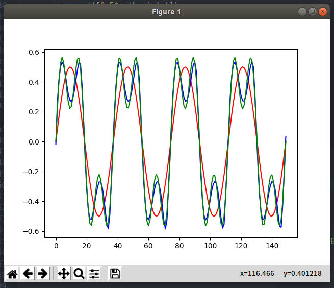
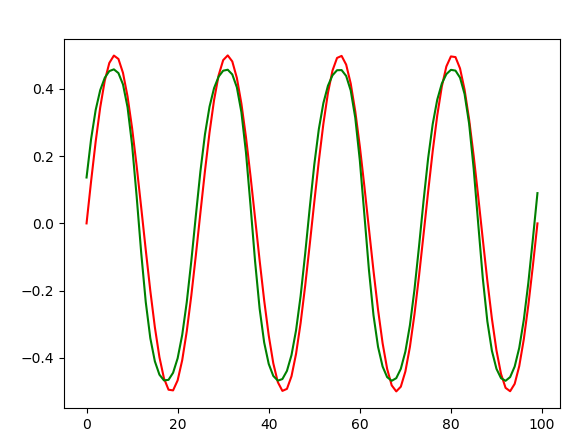
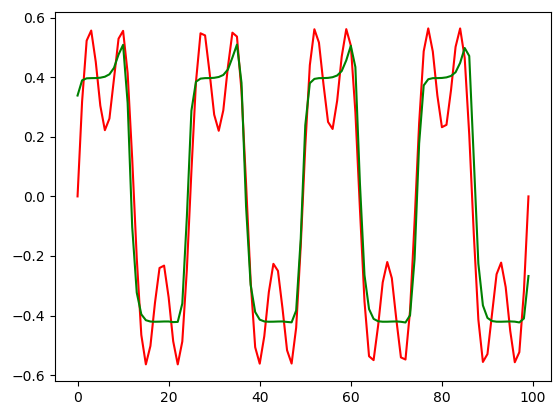

# LSTM

Example:

    python test.py

Output:

Red line is input sequence. Green line is output sequence. Blue line is LSTM output.

`sinx.py` and `wave.py`.

File `lstm-readme.py` include some comments, You can read it and know how to use API `tf.keras.layers.LSTM`.
